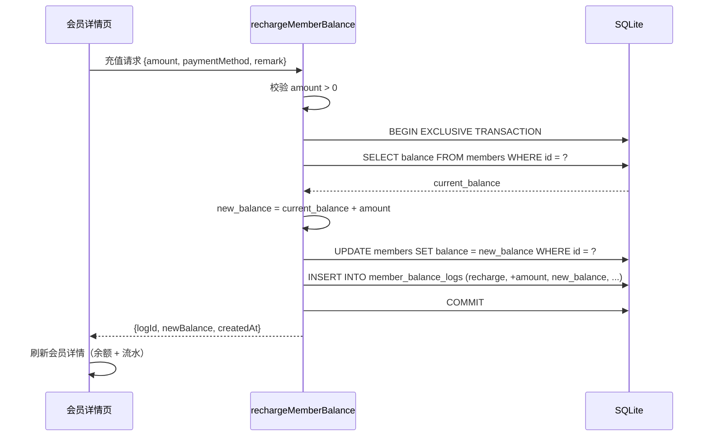
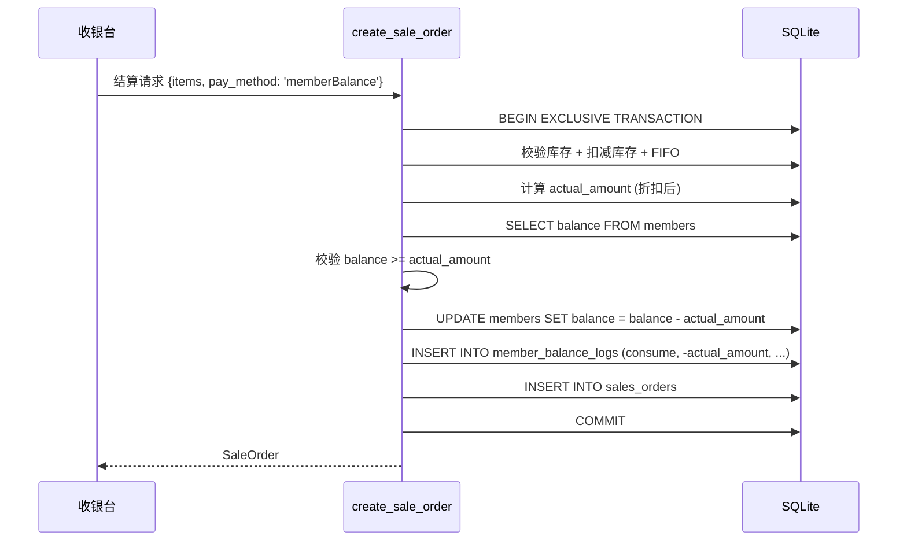
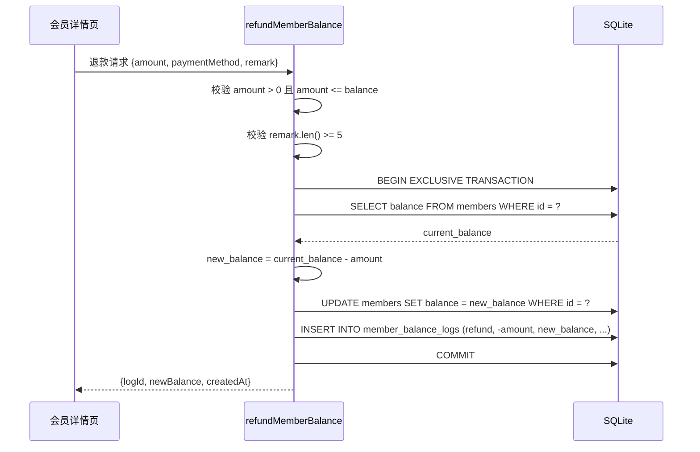

# M06 - 储值余额功能 - 技术方案

> **功能模块**：M05 会员管理 - 储值余额子模块
> **目标版本**：v0.3.1
> **创建日期**：2026-07-02
> **关联文档**：
> - 需求：[M06-储值余额功能.md](file:///d:/AI/AI/开发/茶叶店管理/specs/features/M06-储值余额功能.md)
> - 上游：[M05-会员管理.md](file:///d:/AI/AI/开发/茶叶店管理/specs/features/M05-会员管理.md)

---

## 一、技术选型

| 项目 | 选型 | 理由 |
|------|------|------|
| 数据库迁移 | rusqlite + 现有 migrate_v{N} 模式 | 与 v0.2.0/v0.3.0 一致 |
| 事务隔离 | BEGIN EXCLUSIVE TRANSACTION | 与采购入库/销售订单保持一致 |
| 后端架构 | Tauri Commands + 内部 impl 函数 | 便于单元测试 |
| 前端组件 | Naive UI (n-modal/n-form/n-data-table) | 与现有 UI 一致 |
| 状态管理 | Pinia (useMemberStore) | 复用现有 Store |
| API 风格 | 复用 `src/api/` 目录 | 命名风格：`xxxMember` 形式 |

---

## 二、代码库调研

### 2.1 现有结构

| 模块 | 现状 | 改造点 |
|------|------|--------|
| `members` 表 | ✅ 已有 `balance REAL` 字段 | 无需修改 |
| `sales_orders` 表 | ✅ 已有 `pay_method TEXT` 字段 | 复用，无需修改 |
| `create_sale_order` | ⚠️ 接收 `pay_method` 但未对 `memberBalance` 做扣款 | 需改造 |
| 收银台 UI | ✅ payMethods 已包含 `memberBalance` | 仅需余额不足校验 |
| MemberDetail.vue | ⚠️ 充值按钮已存在，handleRecharge 是占位 | 需完善 + 退款 + 流水 |
| `members.ts` API | ✅ 基础 CRUD 已实现 | 需新增余额相关 API |
| `useMemberStore` | ✅ 基础 store 已实现 | 需扩展 |

### 2.2 关键代码片段

**现有 sales.rs 中的 balance 保护**（[sales.rs:411-421](file:///d:/AI/AI/开发/茶叶店管理/tea-manage/src-tauri/src/commands/sales.rs#L411-L421)）：

```rust
// CR-08: 确保会员余额不会变负（WHERE balance >= 扣减金额）
// 积分抵扣不影响余额，此处仅做保护性校验
let balance_check: f64 = conn.query_row(
    "SELECT balance FROM members WHERE id = ?",
    [mid],
    |row| row.get(0),
).map_err(|e| rollback_on_err(e.to_string(), &conn))?;

if balance_check < 0.0 {
    return Err(rollback_on_err("会员余额不足".to_string(), &conn));
}
```

**问题**：当前只做了"扣款后不能为负"的检查，但实际上**没有真正扣减余额**。v0.3.1 需在此处增加 UPDATE。

**前端 payMethods**（[sales/index.vue:347-353](file:///d:/AI/AI/开发/茶叶店管理/tea-manage/src/views/sales/index.vue#L347-L353)）：

```typescript
const payMethods = [
    { label: '现金', value: 'cash' },
    { label: '微信', value: 'wechat' },
    { label: '支付宝', value: 'alipay' },
    { label: '会员卡', value: 'memberBalance' }
]
```

✅ 已有 `memberBalance` 选项，前端无需修改 payMethods。

---

## 三、数据库迁移方案

### 3.1 变更清单

| 类型 | 对象 | 说明 |
|------|------|------|
| 新增表 | `member_balance_logs` | 储值流水表（11 字段 + 4 索引） |
| 修改字段 | 无 | 复用现有 `members.balance` 和 `sales_orders.pay_method` |
| 数据迁移 | 无 | 全新表，无需回填 |

### 3.2 迁移版本号

| 项目 | 值 |
|------|-----|
| 当前 SCHEMA_VERSION | 3（v0.3.0） |
| 本次迁移版本 | **4** |
| 迁移函数 | `migrate_v4_member_balance_logs` |
| 迁移描述 | 新增会员储值余额流水表 |

### 3.3 SQL 设计

```sql
-- migrate_v4_member_balance_logs
CREATE TABLE IF NOT EXISTS member_balance_logs (
    id TEXT PRIMARY KEY NOT NULL,
    member_id TEXT NOT NULL,
    change_type TEXT NOT NULL
        CHECK (change_type IN ('recharge', 'consume', 'refund')),
    change_amount REAL NOT NULL,
    balance_after REAL NOT NULL,
    payment_method TEXT NOT NULL
        CHECK (payment_method IN ('cash', 'wechat', 'alipay')),
    operator TEXT NOT NULL,
    related_order_id TEXT,
    bonus_amount REAL NOT NULL DEFAULT 0,    -- v0.3.1 预留
    fee_amount REAL NOT NULL DEFAULT 0,      -- v0.3.1 预留
    remark TEXT NOT NULL DEFAULT '',
    created_at TEXT NOT NULL DEFAULT (datetime('now')),
    FOREIGN KEY (member_id) REFERENCES members(id) ON DELETE RESTRICT,
    FOREIGN KEY (related_order_id) REFERENCES sales_orders(id) ON DELETE SET NULL
);

CREATE INDEX IF NOT EXISTS idx_balance_log_member ON member_balance_logs(member_id);
CREATE INDEX IF NOT EXISTS idx_balance_log_type ON member_balance_logs(change_type);
CREATE INDEX IF NOT EXISTS idx_balance_log_created ON member_balance_logs(created_at);
CREATE INDEX IF NOT EXISTS idx_balance_log_order ON member_balance_logs(related_order_id);
```

### 3.4 回滚策略

| 情况 | 策略 |
|------|------|
| 迁移失败 | 事务回滚，旧数据不受影响 |
| 字段调整 | 暂不需要，旧字段（balance）继续使用 |
| 应用回滚到 v0.3.0 | 卸载 v0.3.1 应用，安装 v0.3.0，**保留** `member_balance_logs` 表（v0.3.0 不会使用但会保留数据） |

### 3.5 注册迁移

修改 [schema.rs:15](file:///d:/AI/AI/开发/茶叶店管理/tea-manage/src-tauri/src/db/schema.rs#L15)：

```rust
/// 当前数据库 Schema 版本号
/// - v1: 初始版本（商品/库存/会员/销售）
/// - v2: 新增供应商表、退货出库单表、退货出库明细表（M04 出入库闭环）
/// - v3: 新增采购入库主单表 + 采购明细表（M04 出入库闭环完善）
/// - v4: 新增会员储值余额流水表（M06 储值余额功能）
const SCHEMA_VERSION: u32 = 4;
```

修改 [schema.rs:21-47](file:///d:/AI/AI/开发/茶叶店管理/tea-manage/src-tauri/src/db/schema.rs#L21-L47) 的 `run_migrations`：

```rust
pub fn run_migrations(conn: &Connection) -> SqliteResult<()> {
    let current_version: u32 = conn.pragma_query_value(None, "user_version", |row| row.get(0))?;

    if current_version < 1 { create_tables(conn)?; }
    if current_version < 2 { migrate_v2_suppliers_and_return(conn)?; }
    if current_version < 3 { migrate_v3_purchase_orders(conn)?; }
    if current_version < 4 {
        // v4: M06 储值余额功能 - 会员储值流水表
        migrate_v4_member_balance_logs(conn)?;
    }

    if current_version < SCHEMA_VERSION {
        create_composite_indexes(conn)?;
        conn.pragma_update(None, "user_version", SCHEMA_VERSION)?;
    }

    Ok(())
}
```

---

## 四、API 设计

### 4.1 后端 Commands

#### Command 1: `recharge_member_balance`

**位置**：`src-tauri/src/commands/members.rs`（新建文件）

```rust
/// 会员充值
///
/// # Arguments
/// * `db` - Tauri State
/// * `input` - 充值输入
///
/// # Returns
/// * `Result<RechargeResult, String>` - 成功返回新余额和流水ID，失败返回错误
#[tauri::command]
pub async fn recharge_member_balance(
    db: tauri::State<'_, Database>,
    input: RechargeInput,
) -> Result<RechargeResult, String> {
    recharge_member_balance_impl(&db.get_conn()?, input)
}
```

**输入**（`RechargeInput`）：
```rust
#[derive(Debug, Clone, Deserialize)]
#[serde(rename_all = "camelCase")]
pub struct RechargeInput {
    pub member_id: String,
    pub amount: f64,                     // 充值金额（正数，>0）
    pub payment_method: String,          // cash | wechat | alipay
    pub operator: String,                // 操作人
    pub remark: Option<String>,
    #[serde(default)]
    pub bonus_amount: f64,               // v0.3.1 预留，默认 0
}
```

**输出**（`RechargeResult`）：
```rust
#[derive(Debug, Clone, Serialize)]
#[serde(rename_all = "camelCase")]
pub struct RechargeResult {
    pub log_id: String,
    pub new_balance: f64,
    pub created_at: String,
}
```

#### Command 2: `refund_member_balance`

```rust
/// 会员退款
#[tauri::command]
pub async fn refund_member_balance(
    db: tauri::State<'_, Database>,
    input: RefundInput,
) -> Result<RefundResult, String> {
    refund_member_balance_impl(&db.get_conn()?, input)
}
```

**输入**（`RefundInput`）：
```rust
#[derive(Debug, Clone, Deserialize)]
#[serde(rename_all = "camelCase")]
pub struct RefundInput {
    pub member_id: String,
    pub amount: f64,                     // 退款金额（正数，>0 且 ≤ 当前余额）
    pub payment_method: String,          // cash | wechat | alipay
    pub operator: String,
    pub remark: String,                  // 必填，≥5 字符
}
```

**输出**（`RefundResult`）：
```rust
#[derive(Debug, Clone, Serialize)]
#[serde(rename_all = "camelCase")]
pub struct RefundResult {
    pub log_id: String,
    pub new_balance: f64,
    pub created_at: String,
}
```

#### Command 3: `get_member_balance_logs`

```rust
/// 获取会员储值流水（分页 + 类型筛选）
#[tauri::command]
pub async fn get_member_balance_logs(
    db: tauri::State<'_, Database>,
    member_id: String,
    page: Option<i64>,
    page_size: Option<i64>,
    change_type: Option<String>,         // recharge | consume | refund
) -> Result<PageResult<BalanceLog>, String> {
    get_member_balance_logs_impl(&db.get_conn()?, member_id, page, page_size, change_type)
}
```

**输出**（`BalanceLog`）：
```rust
#[derive(Debug, Clone, Serialize, Deserialize)]
#[serde(rename_all = "camelCase")]
pub struct BalanceLog {
    pub id: String,
    pub member_id: String,
    pub change_type: String,
    pub change_amount: f64,
    pub balance_after: f64,
    pub payment_method: String,
    pub operator: String,
    pub related_order_id: Option<String>,
    pub bonus_amount: f64,
    pub fee_amount: f64,
    pub remark: String,
    pub created_at: String,
}
```

#### Command 4: `get_member_last_payment_method`（辅助）

```rust
/// 获取会员最近一次充值的支付方式（用于退款时默认选择）
#[tauri::command]
pub async fn get_member_last_payment_method(
    db: tauri::State<'_, Database>,
    member_id: String,
) -> Result<Option<String>, String> {
    get_member_last_payment_method_impl(&db.get_conn()?, member_id)
}
```

### 4.2 create_sale_order 改造点

修改 [sales.rs:411-421](file:///d:/AI/AI/开发/茶叶店管理/tea-manage/src-tauri/src/commands/sales.rs#L411-L421)：

```rust
// v0.3.1 改造：当 pay_method='memberBalance' 时扣减余额 + 记录流水
if input.pay_method == "memberBalance" {
    if let Some(ref mid) = input.member_id {
        // 1. 查询当前余额
        let current_balance: f64 = conn.query_row(
            "SELECT balance FROM members WHERE id = ?",
            [mid],
            |row| row.get(0),
        ).map_err(|e| rollback_on_err(format!("查询会员余额失败: {}", e), &conn))?;

        // 2. 校验余额充足
        if current_balance < actual_amount {
            return Err(rollback_on_err(
                format!("会员余额不足，当前余额 ¥{:.2}，需要支付 ¥{:.2}", current_balance, actual_amount),
                &conn,
            ));
        }

        // 3. 扣减余额
        let new_balance = current_balance - actual_amount;
        conn.execute(
            "UPDATE members SET balance = ?, updated_at = ? WHERE id = ?",
            params![new_balance, now, mid],
        ).map_err(|e| rollback_on_err(format!("扣减余额失败: {}", e), &conn))?;

        // 4. 记录流水
        let log_id = Uuid::new_v4().to_string();
        conn.execute(
            "INSERT INTO member_balance_logs
                (id, member_id, change_type, change_amount, balance_after,
                 payment_method, operator, related_order_id, created_at)
             VALUES (?, ?, 'consume', ?, ?, 'memberBalance', ?, ?, ?)",
            params![log_id, mid, -actual_amount, new_balance, "收银台", order_id, now],
        ).map_err(|e| rollback_on_err(format!("记录余额流水失败: {}", e), &conn))?;
    }
}
```

**关键设计点**：
- **嵌入到 `create_sale_order` 的事务中**：保证订单创建、库存扣减、积分计算、余额扣减的原子性
- **`actual_amount` 作为扣款金额**：这是会员折扣 + 积分抵扣后的实付金额，符合"储值扣款不产生积分"的业务规则
- **`change_amount = -actual_amount`**：扣款为负数
- **`operator = "收银台"`**：因为是从收银台自动触发，不需要店员输入

### 4.3 前端 API

修改 [src/api/members.ts](file:///d:/AI/AI/开发/茶叶店管理/tea-manage/src/api/members.ts)，新增 4 个函数：

```typescript
// 充值
export async function rechargeMemberBalance(
    input: RechargeInput
): Promise<RechargeResult> {
    return await invoke('recharge_member_balance', { input })
}

// 退款
export async function refundMemberBalance(
    input: RefundInput
): Promise<RefundResult> {
    return await invoke('refund_member_balance', { input })
}

// 流水查询
export async function getMemberBalanceLogs(
    memberId: string,
    page?: number,
    pageSize?: number,
    changeType?: string
): Promise<PageResult<BalanceLog>> {
    return await invoke('get_member_balance_logs', {
        memberId,
        page: page || 1,
        page_size: pageSize || 20,
        change_type: changeType || null
    })
}

// 查询最近一次支付方式
export async function getMemberLastPaymentMethod(
    memberId: string
): Promise<string | null> {
    return await invoke('get_member_last_payment_method', { memberId })
}
```

---

## 五、前端实现

### 5.1 MemberDetail.vue 改造

**改造点**：
1. 重构"充值"按钮 → 完整实现 `handleRecharge`（调用 API、刷新余额）
2. 新增"退款"按钮（仅余额 > 0 时显示）
3. 新增"储值流水"标签页（使用 n-tabs）
4. 重构充值弹窗（增加支付方式、备注字段）
5. 新增退款弹窗

**关键组件引用**（遵循 [v0.3.0 现有 UI 风格](file:///d:/AI/AI/开发/茶叶店管理/tea-manage/src/views/members/MemberDetail.vue)）：
- `n-modal` / `n-card` - 弹窗
- `n-form` / `n-form-item` - 表单
- `n-input-number` - 金额输入
- `n-select` - 支付方式选择
- `n-tag` - 类型标签
- `n-data-table` - 流水列表
- `n-tabs` / `n-tab-pane` - 标签页

### 5.2 收银台余额扣款

[src/views/sales/index.vue](file:///d:/AI/AI/开发/茶叶店管理/tea-manage/src/views/sales/index.vue) 已有 `memberBalance` 选项，但需要在选择时增加校验：

```typescript
// 修改 handleCheckout 或新增 validatePayMethod
function validatePayMethod() {
    if (selectedPayMethod.value === 'memberBalance') {
        if (!currentMember.value) {
            message.warning('请先识别会员')
            return false
        }
        if (currentMember.value.balance < finalAmount.value) {
            message.warning(
                `会员余额不足，当前余额 ¥${currentMember.value.balance.toFixed(2)}，` +
                `需要支付 ¥${finalAmount.value.toFixed(2)}`
            )
            return false
        }
    }
    return true
}
```

**不需修改 payMethods**（已含 memberBalance），仅在结算前增加校验。

### 5.3 流水页面 UI

**布局**：
```
[会员详情页]
  ├─ 会员信息卡片
  ├─ 口味偏好卡片
  ├─ [n-tabs 标签页]
  │   ├─ 消费记录（现有）
  │   └─ 储值流水（v0.3.1 新增）
  └─ [操作按钮区]
      ├─ 编辑
      ├─ 充值
      └─ 退款
```

**储值流水标签页表格列**：
| 列名 | 字段 | 渲染 |
|------|------|------|
| 变动类型 | changeType | 标签（充值绿/扣款橙/退款红） |
| 变动金额 | changeAmount | `+¥X.XX` / `-¥X.XX` |
| 支付方式 | paymentMethod | 标签（现金/微信/支付宝） |
| 变动后余额 | balanceAfter | `¥X.XX` |
| 操作人 | operator | 文本 |
| 关联订单 | relatedOrderId | 文本（可点击跳转） |
| 备注 | remark | 文本 |
| 时间 | createdAt | 文本 |

---

## 六、核心逻辑

### 6.1 充值流程



### 6.2 收银扣款流程



### 6.3 退款流程



### 6.4 关键算法

#### 退款方式自动选择

```rust
/// 获取会员最近一次充值的支付方式
pub fn get_member_last_payment_method_impl(
    conn: &Connection,
    member_id: String,
) -> Result<Option<String>, String> {
    let result: Option<String> = conn.query_row(
        "SELECT payment_method FROM member_balance_logs
         WHERE member_id = ? AND change_type = 'recharge'
         ORDER BY created_at DESC LIMIT 1",
        [&member_id],
        |row| row.get(0),
    ).ok();

    Ok(result)  // None 表示该会员从未充值过
}
```

前端调用：
```typescript
// 在退款弹窗打开时调用
const lastMethod = await getMemberLastPaymentMethod(memberId.value)
if (lastMethod) {
    refundForm.paymentMethod = lastMethod
}
```

---

## 七、异常处理

| AC 编号 | 异常场景 | 处理方式 |
|---------|---------|---------|
| AC-R-03 | 充值金额 ≤ 0 | 前端 input-number min=0.01 + 后端校验 `if amount <= 0` |
| AC-R-06 | 余额不足 | 前端校验 + 后端校验（事务中），友好提示 |
| AC-R-09 | 扣款事务失败 | ROLLBACK，订单不创建，余额不变 |
| AC-R-12 | 退款金额 > 余额 | 前端 input-number max=balance + 后端校验 |
| AC-R-13 | 退款备注 < 5 字符 | 前端 minlength=5 + 后端校验 |
| 全局 | 数据库异常 | 错误提示"操作失败，请重试"，事务回滚 |
| 全局 | 会员不存在 | 错误提示"会员不存在" |
| 全局 | 会员已软删除 | 错误提示"会员已停用，无法操作" |
| AC-R-08 | 余额扣款产生积分 | points_earned 永远按 actual_amount 计算（不区分支付方式），符合业务规则 |

---

## 八、版本控制影响

| 项目 | 详情 |
|------|------|
| 数据库变更 | ⚠️ 涉及（新增 1 张表 + 4 个索引） |
| 建议版本号 | v0.3.0 → **v0.3.1**（patch 升级，仅小功能新增） |
| 迁移需求 | ✅ 需要（SCHEMA_VERSION 3 → 4） |
| 前端 API 影响 | 新增 4 个 API，修改 0 个 |
| 收银台 UI 影响 | 仅增加余额不足校验，payMethods 已存在 |
| MemberDetail.vue | 重构 1 个文件（新增退款弹窗 + 储值流水标签页） |

---

## 九、测试策略

### 9.1 单元测试（使用 in-memory SQLite）

**测试用例**（8 个）：

| # | 测试 | 覆盖 AC | 状态 |
|---|------|---------|------|
| 1 | `test_recharge_success` | AC-R-02 | ✅ |
| 2 | `test_recharge_invalid_amount` | AC-R-03 | ✅ |
| 3 | `test_refund_success` | AC-R-11 | ✅ |
| 4 | `test_refund_exceed_balance` | AC-R-12 | ✅ |
| 5 | `test_refund_short_remark` | AC-R-13 | ✅ |
| 6 | `test_consume_balance_in_sale_order` | AC-R-05, AC-R-08, AC-R-09 | ✅ |
| 7 | `test_consume_balance_insufficient` | AC-R-06 | ✅ |
| 8 | `test_query_balance_logs_filter` | AC-R-14, AC-R-15 | ✅ |

### 9.2 集成测试（手动）

- 启动应用 → 会员详情页 → 充值 → 数据库验证
- 启动应用 → 收银台 → 会员识别 → 选"会员卡"支付 → 结算 → 数据库验证
- 启动应用 → 会员详情页 → 退款 → 数据库验证

---

## 十、验收标准映射

| AC 编号 | 对应设计点 |
|---------|-----------|
| AC-R-01 | MemberDetail.vue 充值弹窗 |
| AC-R-02 | `recharge_member_balance` Command + 事务 |
| AC-R-03 | `validate_amount` + 前端 `n-input-number :min="0.01"` |
| AC-R-04 | `payment_method` 字段 + 退款时默认选择 |
| AC-R-05 | `create_sale_order` 改造 + 收银台 payMethods |
| AC-R-06 | `validate_balance` + 友好提示 |
| AC-R-07 | 收银台多种支付方式混用（不需特殊处理，memberBalance 仅作 pay_method 值） |
| AC-R-08 | `points_earned = actual_amount as i64`（不区分支付方式） |
| AC-R-09 | BEGIN EXCLUSIVE TRANSACTION + ROLLBACK |
| AC-R-10 | MemberDetail.vue 退款弹窗 + `get_member_last_payment_method` |
| AC-R-11 | `refund_member_balance` Command + 事务 |
| AC-R-12 | `validate_amount <= balance` + 前端 `n-input-number :max` |
| AC-R-13 | `validate_remark_length` + 前端 `minlength=5` |
| AC-R-14 | `get_member_balance_logs` + n-data-table |
| AC-R-15 | `change_type` 筛选参数 |
| AC-R-16 | MemberDetail.vue + MemberList.vue + sales/index.vue 三处显示 |

---

## 十一、风险提示

| 风险 | 影响 | 应对措施 |
|------|------|---------|
| 收银台余额扣款与现有逻辑冲突 | 高 | 在 create_sale_order 事务中嵌入，CR-08 已有保护性检查 |
| 会员未识别时选了 memberBalance | 中 | 收银台结算前校验，友好提示 |
| 退款方式自动选择不准确 | 低 | 用户可在弹窗手动调整 |
| 流水表增长快 | 低 | 已建索引 member_id + created_at，查询 < 100ms |
| 储值扣款不产生积分的理解 | 低 | 现有 actual_amount 计算已确保 |

---

## 十二、下一阶段

进入 [feature-task-planning](file:///d:/AI/AI/开发/茶叶店管理/.trae/skills/feature-task-planning/SKILL.md) 阶段：基于本技术方案拆解任务清单。
